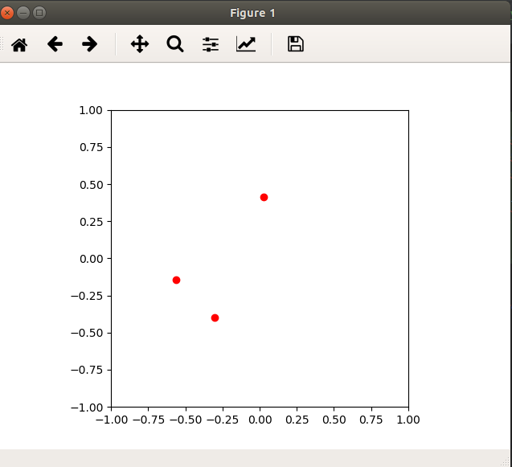

# Modeling Lab

* Prepare the code modeling particle motion

## Lab Goals:

1. Prepare Python code to profile
    * Design the code
    * Make the code run
    
### Builds on:
    * Lecture notes
    
### Time:
    * 1 hour
         
### Step 1) Create a Python mode called `simul.py`

### Step 2) Particle

* Create a class to store particle representation
* It stores the particle positions, x and y, and their angular velocity, ang_vel:

```python
class Particle:
    def __init__(self, x, y, ang_speed):
        self.x = x
        self.y = y
        self.ang_speed = ang_speed
```        

### Step 3) Model particle motion

* Create a class to model particle motion
```python
class ParticleSimulator: 
        
        # Accept the list of particles to model
        def __init__(self, particles): 
            self.particles = particles 

        def evolve(self, dt): 
            timestep = 0.00001 
            nsteps = int(dt/timestep) 
     
            for i in range(nsteps):
                for p in self.particles:
                    # 1. calculate the direction 
                    norm = (p.x**2 + p.y**2)**0.5 
                    v_x = -p.y/norm 
                    v_y = p.x/norm 

                    # 2. calculate the displacement 
                    d_x = timestep * p.ang_vel * v_x 
                    d_y = timestep * p.ang_vel * v_y 
                    
                    # 3. repeat for all the time steps
                    p.x += d_x 
                    p.y += d_y                     
``` 

### Step 4) Write a function to plot the movement of particles

```python
def visualize(simulator):

    X = [p.x for p in simulator.particles]
    Y = [p.y for p in simulator.particles]

    fig = plt.figure()
    ax = plt.subplot(111, aspect='equal')
    line, = ax.plot(X, Y, 'ro')

    # Axis limits
    plt.xlim(-1, 1)
    plt.ylim(-1, 1)

    # It will be run when the animation starts
    def init():
        line.set_data([], [])
        return line,

    def animate(i):
        # We let the particle evolve for 0.1 time units
        simulator.evolve(0.01)
        X = [p.x for p in simulator.particles]
        Y = [p.y for p in simulator.particles]

        line.set_data(X, Y)
        return line,

    # Call the animate function each 10 ms
    anim = animation.FuncAnimation(fig,
                                   animate,
                                   init_func=init,
                                   blit=True,
                                   interval=10)
    plt.show()

```

### Step 5) Prepare a test function to observe the model in action

```python
def test_visualize(): 
    particles = [Particle(0.3, 0.5, 1), 
                 Particle(0.0, -0.5, -1), 
                 Particle(-0.1, -0.4, 3)] 

    simulator = ParticleSimulator(particles) 
    visualize(simulator) 

if __name__ == '__main__': 
    test_visualize()
```
### Step 6) Run the program

* On the command line, run your code

```shell script
python simul.py
```

* Observe the results in motion

