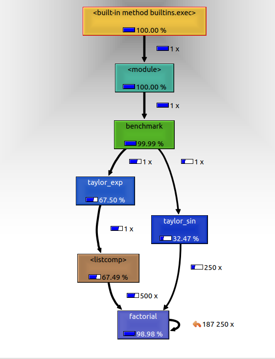

# Profiling Lab

> **Lab tier — hands-on:** do this one yourself.

> **Working directory:** do the simulator labs (modeling -> testing -> timing -> profiling -> numpy -> cython) in **one folder**, and run scripts from inside it. `simul.py` is created in the modeling lab and reused here, so `import simul` works without copying it between folders.

* Learn how to run profile

## Lab Goals:

1. Use the existing code to profile and find bottlenecks
    * Copy the code
    * Run benchmark
    * Profile Python code
    
### Builds on:
    * Previous labs
    
### Time:
    * 30 min
         
### Step 1) Prepare the code for profiling 

* Create a new directory, `profiling`
* Copy the modules, `simul.py` and `benchmark.py` into this directory
          
### Step 2) Run profiling

* On the command line, in this directory, run

```shell script
python -m cProfile benchmark.py
```
* Analyze the output
    * Q: Which function took the most time?
    * It is `simul.py:19(evolve)` but it is hard to see
    
* Run the profiler sorting the results by `tottime`

```shell script
python -m cProfile -s tottime benchmark.py
```    

* To simplify your life, you may run directing the output to a file, like this:
```shell script
python -m cProfile -s tottime benchmark.py > benchmark.txt
```

* You will observe an output similar to this


* Analyze the output
    * Q: Which function took the most time?
    * It is `simul.py:17(evolve)` and it is easier to see
    
### Step 2) Save profiling output into a file

* Create a new file, `taylor.py`
```python
def factorial(n):
    if n == 0:
        return 1.0
    else:
        return n * factorial(n - 1)


def taylor_exp(n):
    return [1.0 / factorial(i) for i in range(n)]


def taylor_sin(n):
    res = []
    for i in range(n):
        if i % 2 == 1:
            res.append((-1) ** ((i - 1) / 2) / float(factorial(i)))
        else:
            res.append(0.0)
    return res


def benchmark():
    taylor_exp(500)
    taylor_sin(500)


if __name__ == '__main__':
    benchmark()
```
* Create a profiler output file
```shell script
python -m cProfile -o prof.out taylor.py
```  

    * Verify that you get the output file, `prof.out`
    * Try to observe its format. It is binary.
    
    
* Prepare to analyze profiler output
```shell script
pyprof2calltree -i prof.out -o prof.calltree
```  

* You should get the following output:
```text
writing converted data to: prof.calltree
```

* Use `KCachegrind` to see the output
```shell script
kcachegrind prof.calltree
```
* (If you don't have it, do `pip install pyprof2calltree`)

* Observe the output of KCachegrind


### Step 3) Improvements

* Add a new file, `simul_fast.py`
* (We have discussed the improvements in the lecture)
* Put the following code in `simul_fast.py`

```python
from matplotlib import pyplot as plt
from matplotlib import animation

class Particle:

    __slots__ = ('x', 'y', 'ang_speed')

    def __init__(self, x, y, ang_speed):
        self.x = x
        self.y = y
        self.ang_speed = ang_speed


class ParticleSimulator:

    def __init__(self, particles):
        self.particles = particles

    def evolve_fast(self, dt):
        timestep = 0.00001
        nsteps = int(dt / timestep)

        # Loop order is changed
        for p in self.particles:
            t_x_ang = timestep * p.ang_speed
            for i in range(nsteps):
                norm = (p.x ** 2 + p.y ** 2) ** 0.5
                p.x, p.y = (p.x - t_x_ang * p.y / norm,
                            p.y + t_x_ang * p.x / norm)

def visualize(simulator):

    X = [p.x for p in simulator.particles]
    Y = [p.y for p in simulator.particles]

    fig = plt.figure()
    ax = plt.subplot(111, aspect='equal')
    line, = ax.plot(X, Y, 'ro')

    # Axis limits
    plt.xlim(-1, 1)
    plt.ylim(-1, 1)

    # It will be run when the animation starts
    def init():
        line.set_data([], [])
        return line,

    def animate(i):
        # We let the particle evolve for 0.1 time units
        simulator.evolve_fast(0.01)
        X = [p.x for p in simulator.particles]
        Y = [p.y for p in simulator.particles]

        line.set_data(X, Y)
        return line,

    # Call the animate function each 10 ms
    anim = animation.FuncAnimation(fig,
                                   animate,
                                   init_func=init,
                                   blit=True,
                                   interval=10)
    plt.show()

def test_visualize():
    particles = [Particle(0.3, 0.5, 1),
                 Particle(0.0, -0.5, -1),
                 Particle(-0.1, -0.4, 3)]

    simulator = ParticleSimulator(particles)
    visualize(simulator)

if __name__ == '__main__':
    test_visualize()
```

* Benchmark the improvements
* Add a new module, `benchmark_fast.py`
* Put the following code in `benchmark_fast.py`

```python
from simul_fast import ParticleSimulator
from simul_fast import Particle

from random import uniform
import sys

def benchmark():
    particles = [Particle(uniform(-1.0, 1.0),
                          uniform(-1.0, 1.0),
                          uniform(-1.0, 1.0))
                 for i in range(1000)]

    simulator = ParticleSimulator(particles)
    simulator.evolve_fast(0.1)

if __name__ == '__main__':
    benchmark()
```
### Step 4) Test the improvements

* Run the timing for the previous benchmark

```shell script
time python benchmark.py
```         

* Your results will be something like the following
```text
real    0m4.773s
user    0m4.729s
sys     0m0.044s

```

Now run the "fast" results and check how fast they are
```shell script
time python benchmark_fast.py
```         

* You should get something like
```text
real    0m3.980s
user    0m3.938s
sys     0m0.041s


```

### Congratulation!
* You have achieved 20% improvements!